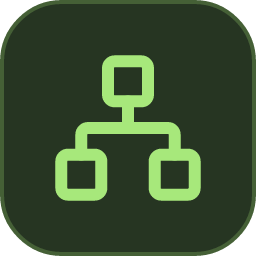

# Knowledge Atlas Dev

A personal knowledge and project workspace for Home Assistant. Keep notes in ordinary Markdown files and explore their connections in a 2D or 3D map.

This is the **development channel**, version **5.0.1-dev.33**. The add-on name and identity are permanent; future major versions update this same add-on. New development versions are published here immediately, without changing the stable channel. See [Release channels](docs/RELEASE-CHANNELS.md).

- Independent atlas spaces with a top selector, empty-space creation, renaming and a saved default. Existing libraries remain in the General space.
- An optional offline cat companion that roams panel edges, peeks out and steps aside while typing.
- Nested branches, cross-links, searchable records and live statistics.
- Open directly on the task timeline; load the knowledge map only through its central **Download knowledge map** button.
- Dated record cards, editable and fixed list positions with automatic renumbering, and date/importance sorting.
- Drag entire branches in 2D/3D, save their positions with the library, and reset each layout independently.
- Persistent Undo and Redo with step counts for saved edits, ratings, ordering and map arrangements.
- Full breadcrumb paths wrap onto multiple lines.
- Six retained map layouts in 2D and 3D, cached geometry and readable labels with progressive detail.
- Combined topic, type and multi-value importance filters.
- Projects, configurable task boards and a timeline with start and due dates.
- Five-tab task cards: details, attachments, comments, activity and checkpoints.
- Full backups or checkbox-selected sections with a merge preview, managed attachments and discussion history.
- Five-star importance controls on records and timeline tasks; importance influences bubble sizes.
- A resizable details panel with a remembered width and keyboard controls.
- Work journals, inventory-linked bills of materials and shopping lists.
- A dedicated notebook journal with day/week/month contents, date ranges, experience markers, linked tasks, photo galleries, EXIF suggestions and offline places.
- Multiple journal attachments, Office text previews and an explicit open-as-text fallback for local files.
- Lightweight journal navigation with server-side text search and attachment previews downloaded only on request.
- Reusable procedures with independent, persistent checklist runs.
- Source-linked flashcards, review history and deterministic review schedules.
- Saved views that automatically recompute from manually edited Markdown.
- Inventory with quantities, location filters and CSV export.
- Configurable physical places, devices and server document roots.
- Integrated Markdown, PDF, text and media previews, UTF-8 editing and file uploads.
- Configurable document opening by bubble double-click, with the map view preserved.
- Compact timeline lanes, open-ended tasks, status filters and smooth Ctrl-wheel/pinch zoom.
- Dated checkpoints with completion criteria, quick checkboxes and deadline-based urgency colors.
- Complete managed-file backups, verified restore previews and reversible schema upgrades.
- Stable attachment IDs, browser drafts, concurrent-edit comparison and source repair tools.
- English by default, with a persistent English/Czech switch in **Settings and locations**.
- Home Assistant Ingress access and persistent storage under `/config`.

## First launch

New installations start empty. Open **Backup and restore** to export all saved library data or import a verified ZIP. Personal backup archives are separate from the add-on source and packages. See [Backup and restore](docs/BACKUP-RESTORE.md) for the exact contents, import steps and recovery behavior.

A fresh installation starts in English and asks you to choose **English** or **Czech**. Confirm once to store the choice on the server. An existing library keeps its current language without a new prompt after an update. You can change it later in **Settings and locations**.

## Install

For local development, run `npm ci`, `npm run build` and `npm start`. On Windows, `Start.ps1` checks the library identity before starting; use `-Port 8102` to run another version alongside the default port 8099. `Stop.ps1` only stops the process owned by that version. Each checkout uses its own `data` directory unless `DATA_DIR` is explicitly set.

The permanent slug is `knowledge_atlas_dev`. It uses a separate add-on configuration volume and an independent library. Installing Dev does not transfer or alter stable data. Real Supervisor installation and container startup are still unverified in this environment.

Install **Knowledge Atlas Dev** from the repository:

1. In Home Assistant, open **Settings → Apps → App store** (called **Add-ons** in older versions).
2. Open **Repositories** and add `https://github.com/Jirkas-prog/home-assistant-addons`.
3. Refresh the store, select **Knowledge Atlas Dev**, install and start it.
4. Select **Open web UI**. Use the settings page to configure the language, document root and locations.

For a manual installation, copy this directory to `/addons/knowledge_atlas_dev`, then reload the local app store.

Home Assistant builds the image locally from the Dockerfile. Supported architectures are `amd64` and `aarch64`. See [Validation](docs/VERIFICATION.md) for tested environments and remaining limits.

Fresh installations start with an empty library. Existing libraries are preserved. No personal library or machine-specific settings are included in this repository.

See [DOCS.md](DOCS.md) for operation and backups, [FORMAT.md](FORMAT.md) for manual records, and [CHANGELOG.md](CHANGELOG.md) for releases.

### Task planning and journal handoff

Switch tasks between Board, Timeline, and Calendar. The calendar uses the journal's day, week, month, and year navigation. A task with a start and due date spans that inclusive range; with only one date it appears on that date. Undated tasks remain accessible under **No date**. Timeline open-ended ranges are unchanged. Click a calendar date to prefill a new task.

Choose **Set as default** below the view to remember that layout (and the calendar period) for this atlas space. The preference lives in its settings and settings backups. Other spaces keep their own defaults.

In a task card, **New project** creates and selects a project while preserving the task draft. **Write in journal**, or **Save and write in journal**, opens an editable journal draft for today, linked to that task and project. It reuses the title, tags, and importance. Saving the journal does not complete the task. Attachments are neither copied nor fetched by this action.

Dropdowns use an application menu on desktop and mobile. Long lists include search; arrows, Home/End, Enter, Escape and Tab work without the operating system's picker. Space switching remains within the add-on, including Home Assistant Ingress.
